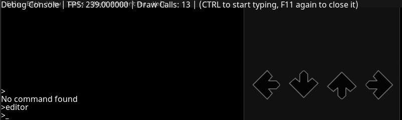
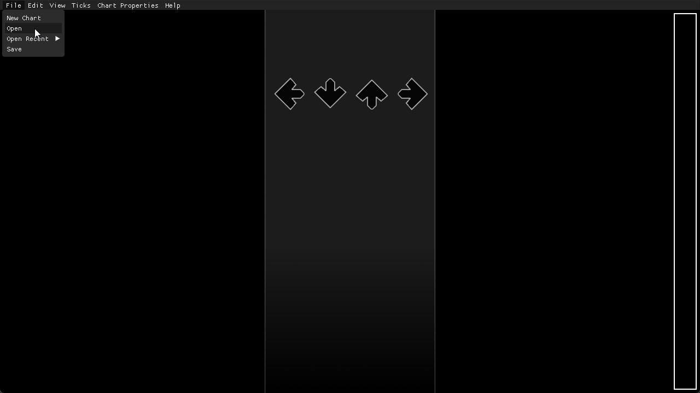
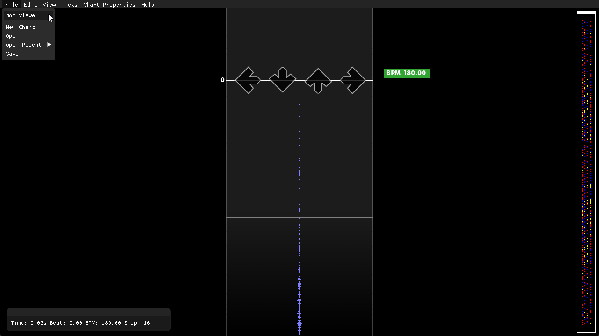

## Setting up the modfile
> Quick guide on the structure, and how to setup a modfile

*don't want to read? check out this video tutorial [here](https://www.youtube.com/watch?v=5EfC9jMnxh0&feature=youtu.be)*

Average4K's default chart directories look something like this:

```
└── chartFolder
     ├── chart.sm
     └── banner.png
```

Which works for regular files, but to make this a modfile. You have to create a **mod** folder

```
└── chartFolder/
     ├── chart.sm
     ├── banner.png
     └── mod/
         └── mod.lua
```

This folder also contains a **lua** file called *"mod.lua"*.

Inside this file is where all of the lua code will go, and the template for the initial state of a modchart is:

```lua
function create()
    -- Lua! Horray
end
```

## Mod viewer

To actually see the mods without going into the song again and again, you should use the **Mod Viewer**!

This tool is located inside of the editor, and you can get to the editor by pressing **F11** (Getting into the console), 

Then press **enter**,

And then type in **"editor"**



Welcome to the editor! You can use this to also create charts, but currently it is a little buggy.

Don't worry though, we are just opening a chart for now.

Now lets go ahead and open a chart by clicking on the **File** option in the top left,

Then click **open**, and navigate to the chart which is in *"assets/charts/your-pack/your-chart"* (double click items to actually go into them)



After that, you'll see a bunch of things pop up. Probably some notes, and a bpm section.

Ignore that for now, and head back up to the **top left**, and click mod viewer.



After that you should be inside the mod viewer, and in this view you can scroll up and down to preview modfiles!

You can also press **F5** to hot reload changes, and **Space** to play the song.

Now we can move on to **creating modfiles**.

## Activating mods

To start off, lets try enabling drunk.

Put this inside of your create function.

```lua
function create()
    -- Sets drunk to 100% on the modfile's start, and tweens it to that over the span of 4 beats
    activateMod("drunk", 0, 4, "outcubic", 1)
end
```

Then press **F5** in the mod viewer to view your new changes.

You should now see some dancing arrows! You are pretty much half way there when creating a modfile.

You can now visit the other pages on the left to create different effects by combining mods.

Some pages you should visit include:
- [Built-In Mods](Mods.md)
- [Events](Events.md)
- [Functions](Functions.md)

Happy modfile creating!